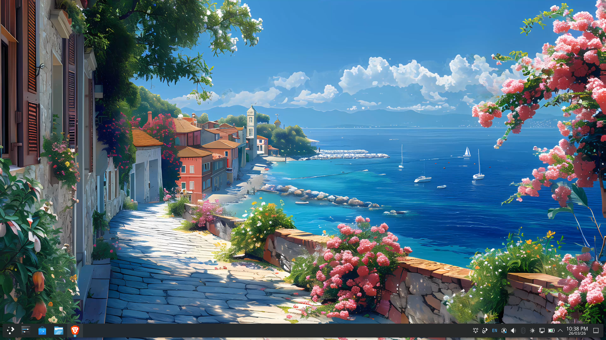

# linux-installation
here I will log everything related to bugs and what i learnt by them just about installation and stuff on linux, I don't have words. I am so proud of me today. All because I wanted live wallpapers oh my God.

### (or: how I broke my system, fixed it, and then came back months later to break it again — intentionally)

---

## 🚩 Phase 1 — First time installing Linux

I installed Linux for the first time thinking it would be straightforward.

It wasn’t.

Booted in → no WiFi.
Not “slow internet” — literally **no network interface working**.

Turns out:

* my WiFi adapter didn’t have proper Linux drivers
* and I had no idea how to fix that yet

So I was just sitting there in a terminal, with no internet, wondering what I just did.

---

## 🔧 First workaround (jugaad mode)

Used **USB tethering from my phone**.

That gave me internet access, and honestly that felt like unlocking level 1.

👉 Lesson:
If you don’t have internet, Linux becomes 10x harder instantly.

---

## 💥 Phase 2 — Bootloader disaster

Then I made a bigger mistake.

I tried removing Linux from a **dual boot setup** without really understanding how bootloaders work.

Result:

* black screen on boot
* Windows not loading properly
* system stuck in a weird state

I had basically messed up **GRUB / boot configuration**.

---

## 😨 At this point

Realistically:

* this is where most people stop
* or go to a repair shop

And yeah, this could’ve easily cost ₹5k–₹10k.

---

## 🔧 **GRUB** fix- Recovery (this was the turning point)

Instead of giving up:

* I interrupted Windows boot on purpose
* entered recovery mode
* opened CLI from there

From that environment, I:

* navigated system files
* removed / fixed the broken boot entry

I didn’t understand everything perfectly.

But I understood enough:
👉 firmware → bootloader → OS

And somehow…

👉 I got Windows back.

---

## 🧠 What changed here

Before this:

* I used my laptop

After this:

* I started understanding how it actually boots

---

## 🔁 Phase 3 — Reinstall, but smarter

I installed Linux again.

This time:

* used USB tethering from the start
* avoided the earlier mistakes

Later:
👉 bought a **WiFi dongle**

Now:

* stable internet
* usable system

---

## This was me learning how to peer into vpc back when I was working in genome wayland by default

---

# ⏳ (Time passes…)

---

## 🎬 Phase 4 — The wallpaper side quest

Months later, I decided:

“Let’s set a dynamic wallpaper.”

This was not necessary at all.

But it turned into another deep dive.

---

## ❌ Attempt 1 — xwinwrap

Tried using `xwinwrap` (old X11-based approach).

What I did:

* installed X11 dev libraries
* compiled from source
* ran commands with `mpv`

What happened:

* errors like `BadMatch`
* wallpaper didn’t render

👉 Insight:
X11 allows this kind of hack, but modern environments don’t always cooperate.

---

## ❌ Attempt 2 — mpvpaper

Then I tried `mpvpaper`.

This turned into dependency debugging:

* missing `pkg-config`
* missing `wayland-protocols`
* missing `egl` libraries

Installed everything, rebuilt using:

* `meson`
* `ninja`

Still:
👉 inconsistent behavior on GNOME

---

## 🧠 Realization

The issue wasn’t just tools.

It was the **desktop environment + display system**:

* GNOME (especially with Wayland) is restrictive - This is you default when you install debian linux
* X11 hacks don’t behave reliably anymore

---

## 🔥 Phase 5 — The actual solution

Instead of forcing it further:

👉 I switched to **KDE Plasma**

Installed it, logged in, and:

* used built-in plugin system
* applied video wallpaper normally

No weird errors. It worked!!

---

#This is my new workspace now..

---

## 🎉 Final state

* Linux installed properly
* Boot issues resolved
* Networking stable (dongle)
* KDE Plasma running
* Video wallpaper working

---

## 🧠 What I actually learned

Not just commands — but systems:

### 🔹 Boot process

Firmware → Bootloader → OS

### 🔹 Networking reality

Drivers matter. Hardware compatibility matters.

### 🔹 Display stack

* X11 = flexible, hackable
* Wayland = modern, but restrictive

### 🔹 Desktop environments

* GNOME = clean, but controlled
* KDE = customizable, more open

---

## 💭 Reflection

The important part wasn’t:

* installing Linux
* or setting a wallpaper

It was:

* not panicking when things broke
* figuring things out step by step
* knowing when to stop forcing a tool and switch approach

---

## 🏁 Closing note

I almost broke my system.

Twice.

Once accidentally.
Once intentionally.

Both times I learned something real.
